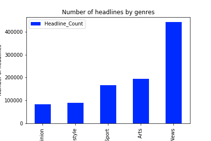

# The Guardian News

We will analysis the guarrdian news. Web scraping is really really fun. 

## How many headlines per year are published in years 2005 to 2019?

## What genres are they writing about these 15 years?

## What are they writing abaout?

numberOfHlineByGenre.png

## How are the networks for the most frequent words in the headline data?

## How is the sentimental analysis ?

dhfjdshfjdshfjewhfuw

